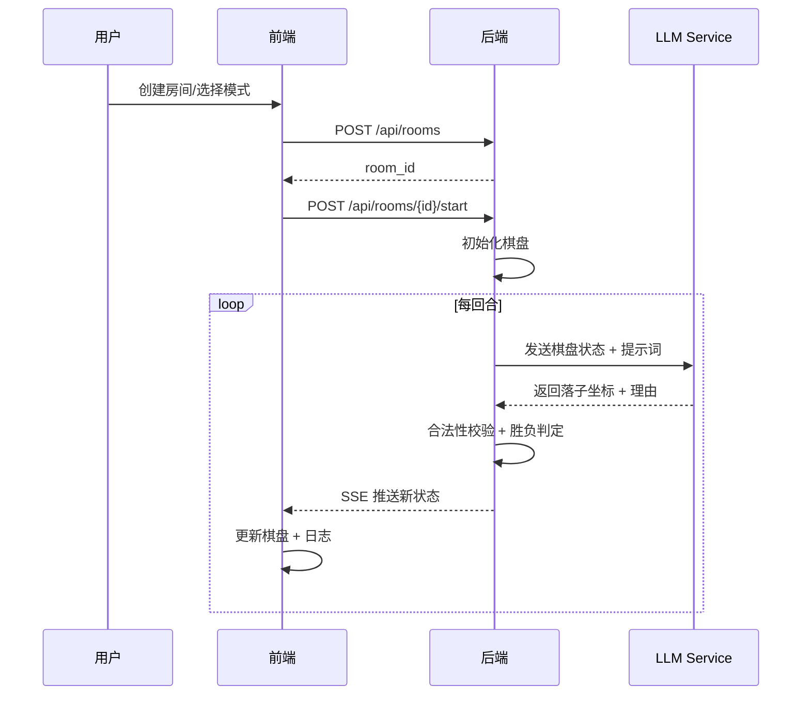

# AI Gomoku 系统架构设计

## 1. 实现方案 + 框架选型
- **后端**：FastAPI（Python 3.10+），SQLite 持久化配置，HTTP/SSE 推送
- **前端**：Vite + React + TypeScript + Tailwind CSS + Zustand
- **通信**：REST API + Server-Sent Events（观战实时推棋盘状态）
- **AI 集成**：OpenAI 兼容接口（`/v1/chat/completions`），统一适配
- **棋盘逻辑**：纯 Python 类，无外部依赖
- **部署**：`uvicorn` 单进程，前端 Vite 构建产物由 FastAPI `StaticFiles` 托管

## 2. 文件列表
```
backend/
  app/
    __init__.py
    main.py
    models/
      __init__.py
      config.py
      ai_player.py
      room.py
      game.py
    services/
      __init__.py
      llm_service.py
      game_service.py
      room_service.py
    routers/
      __init__.py
      configs.py
      players.py
      rooms.py
      game.py
  tests/
    test_game_logic.py
    test_llm_service.py
  requirements.txt
  pyproject.toml

frontend/
  index.html
  package.json
  vite.config.ts
  tailwind.config.js
  postcss.config.js
  src/
    main.tsx
    App.tsx
    index.css
    types.ts
    services/api.ts
    store/
      useRoomStore.ts
      useConfigStore.ts
    components/
      Board.tsx
      RoomList.tsx
      ConfigPanel.tsx
      GameTable.tsx
      LogPanel.tsx
      PlayerSelect.tsx
    pages/
      Home.tsx
      ConfigPage.tsx
      RoomPage.tsx
      GamePage.tsx
    utils/
      board.ts
```

## 3. 数据结构与接口
### 后端 Models
- `ModelConfig`: id, name, base_url, api_key, models[], created_at
- `AIPlayer`: id, name, model_config_id, model_id, temperature, created_at
- `Room`: id, mode (pve/watch), seats[{player_id, role}], status, created_at
- `Game`: id, room_id, board[15][15], turn, history[], winner, logs[], scores

### 关键接口
- `POST /api/configs` 创建配置
- `POST /api/configs/{id}/test` 连通性测试
- `POST /api/configs/{id}/models` 拉取模型列表
- `GET/POST/PUT/DELETE /api/players` AI 玩家管理
- `POST /api/rooms` 创建房间
- `POST /api/rooms/{id}/start` 开始游戏
- `POST /api/games/{id}/move` 落子（用户）
- `GET /api/games/{id}/state` 获取状态
- `GET /api/games/{id}/stream` SSE 推送

## 4. 程序调用流程


## 5. 任务列表（按实现顺序）
1. 后端项目骨架 + 数据模型（Model）
2. 五子棋核心逻辑（board, win check, move validation）
3. LLM 服务封装（OpenAI 兼容，含兜底策略）
4. 配置/玩家/房间 CRUD 路由
5. 游戏状态机 + 落子/胜负逻辑
6. SSE 实时推送
7. 前端项目骨架 + Tailwind
8. 配置页面（模型管理、AI 玩家管理）
9. 房间列表 + 创建房间
10. 棋盘组件（响应式）+ 日志面板
11. 人机模式完整流程
12. 观战模式完整流程
13. 连通性测试 + 错误处理

## 6. 依赖包
- 后端：fastapi, uvicorn[standard], pydantic, sqlalchemy, httpx, python-dotenv, sse-starlette
- 前端：react, react-dom, zustand, axios, tailwindcss, postcss, autoprefixer, vite, @vitejs/plugin-react

## 7. 共享知识
- 棋盘坐标：0-14，落子格式 `{"row": 7, "col": 8}`
- LLM 返回兜底：若 JSON 解析失败或坐标非法，降级为随机空位
- 日志条数上限：保留最近 50 条
- SSE 事件类型：`game_update`, `game_over`, `error`

## 8. 待明确事项
- 用户系统：v1 本地存储，后续再接入账号
- 积分规则：胜 +1，负 -1，观战不计
- 落子超时：默认 30s
- 禁手：v1 无禁手，自由规则
- 前端状态管理：Zustand
